# alura_store

## 📊 Análise das Lojas da AluraStore - Relatório Final 

### Introdução ao desafio

O objetivo do relatório é apoiar e definir a decisão estratégica de negócios do Senhor João sobre **qual das quatro lojas virtuais da 'AluraStore' deve ser vendida**. 
Para isso, foi feita uma análise  baseada em dados reais de vendas e desempenho de cada loja. Os fatores considerados incluem o faturamento total, categorias e produtos mais/menos vendidos, média das avaliações dos clientes e o custo médio do frete. Com essas informações, foi possível analisar e identificar pontos fortes e fracos de cada loja, resultando em uma recomendação objetiva e fundamentada para a decisão final ser tomada. 

---

### Desenvolvimento

#### 💰 Faturamento Total das Lojas

O faturamento foi calculado somando o valor dos produtos vendidos juntamente com o valor do frete cobrado:

* **Loja 1**: R$ 1.616.347,09
* **Loja 2**: R$ 1.567.773,22
* **Loja 3**: R$ 1.542.047,69
* **Loja 4**: R$ 1.458.253,46

  
📊 Ver gráfico de faturamento total

  
  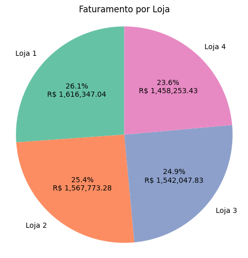

> 

Mediante analise, a **Loja 1** apresenta o maior faturamento, o que a torna valiosa em termos de volume de vendas e rentabilidade bruta para o Senhor João.

---

#### 🛍️ Categorias de Produtos

As categorias mais e menos vendidas por cada loja foram:

* **Loja 1**:  Mais vendida: *móveis (465)* / Menos vendida: *utilidades domésticas (171)*
* **Loja 2**:  Mais vendida: *móveis (442)* / Menos vendida: *utilidades domésticas (181)*
* **Loja 3**:  Mais vendida: *móveis (499)* / Menos vendida: *instrumentos musicais & utilidades domésticas (177)*
* **Loja 4**:  Mais vendida: *móveis (480)* / Menos vendida: *instrumentos musicais (170)*

  
📊 Ver gráficos referente as categorias mais e menos vendidas

  
  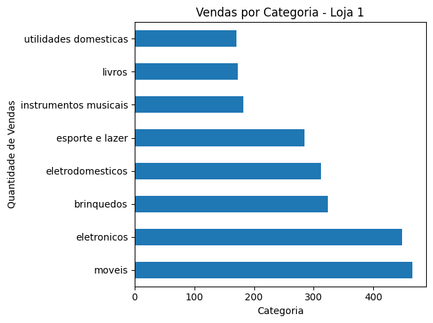

  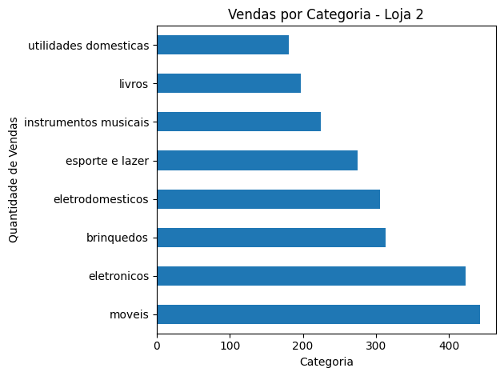

  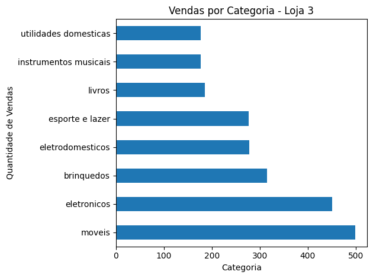

  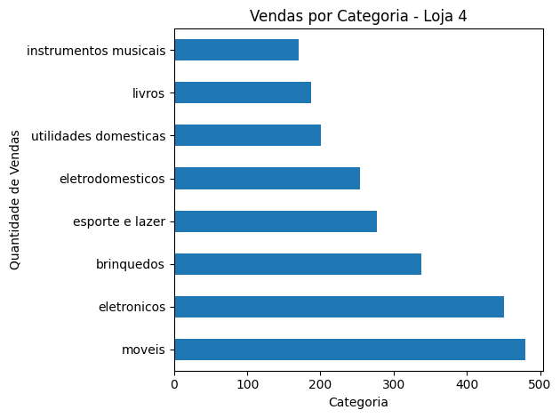

> 

---

#### ⭐ Média de Avaliações dos Clientes

* **Loja 1**: 3.98 ⭐⭐⭐⭐☆
* **Loja 2**: 4.04 ⭐⭐⭐⭐☆
* **Loja 3**: 4.05 ⭐⭐⭐⭐☆
* **Loja 4**: 4.00 ⭐⭐⭐⭐☆

  
📊 Ver gráficos referente as médias das avaliações

  
  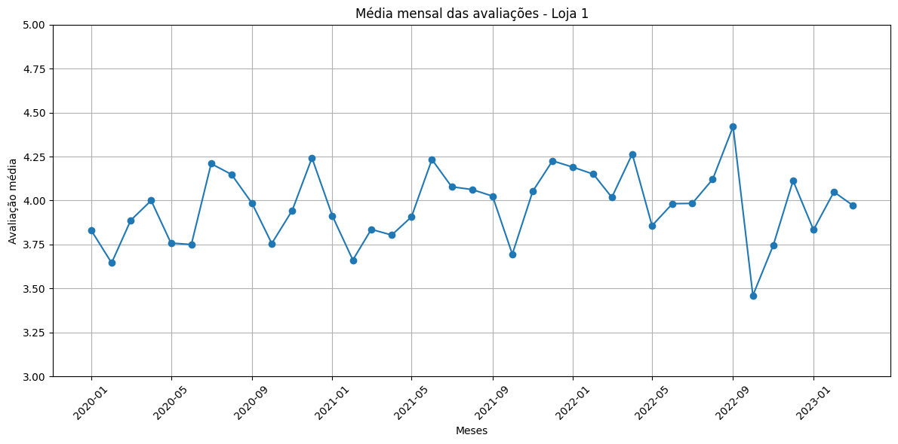

  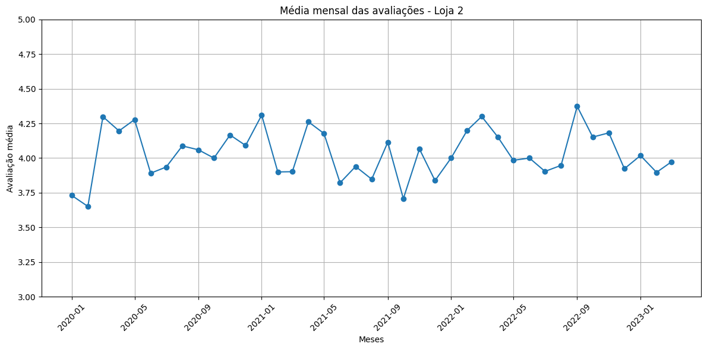

  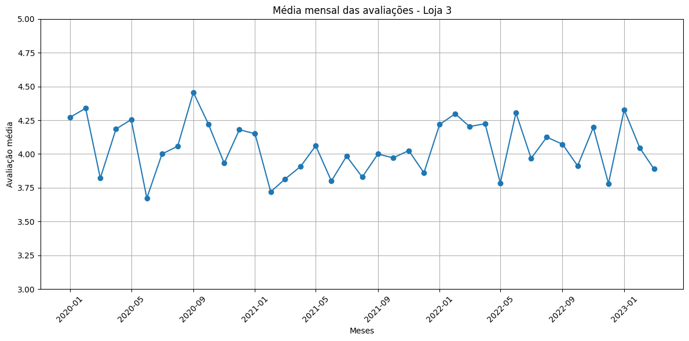

  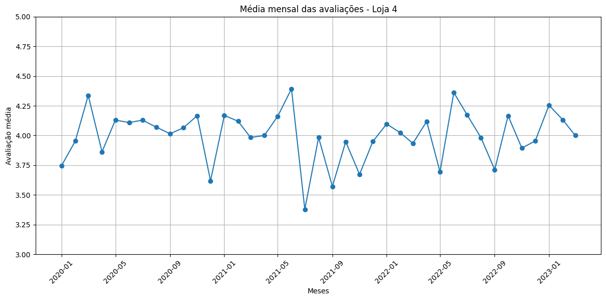

> 

**A Loja 3** possui a maior média de avaliações, indicando um alto nível de satisfação por parte dos clientes.

---

#### 💁 Produtos Mais e Menos Vendidos

* **Loja 1**: Mais vendido: *Micro-ondas (60)* / Menos vendido: *Headset (33)*
* **Loja 2**: Mais vendido: *Iniciando em programação (65)* / Menos vendido: *Jogo de tabuleiro (32)*
* **Loja 3**: Mais vendido: *Kit banquetas (57)* / Menos vendido: *Blocos de montar (35)*
* **Loja 4**: Mais vendido: *Cama box (62)* / Menos vendido: *Guitarra (33)*

  
📊 Ver gráfico dos produtos mais vendidos

  
  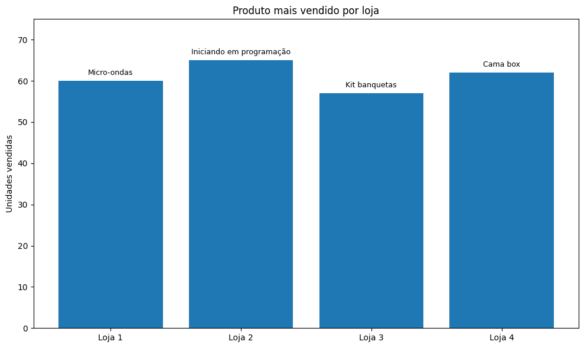

  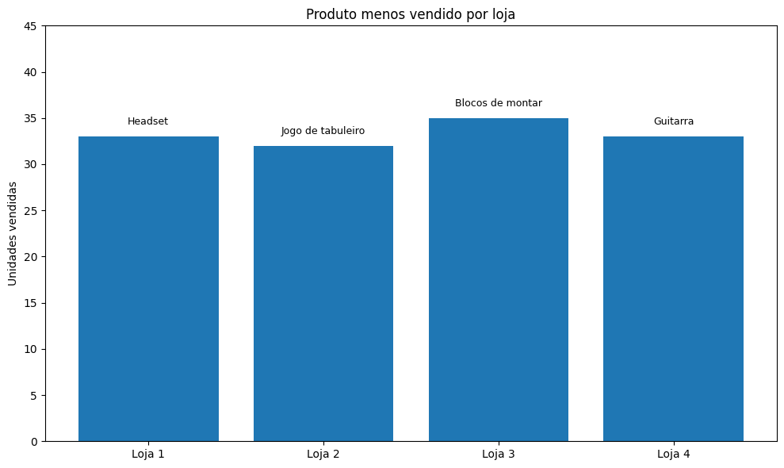

> 

---

#### 🚚 Custo Médio do Frete

* **Loja 1**: R\$ 34,69
* **Loja 2**: R\$ 33,62
* **Loja 3**: R\$ 33,07
* **Loja 4**: R\$ 31,28

  
📊 Ver gráfico dos produtos mais vendidos

  
  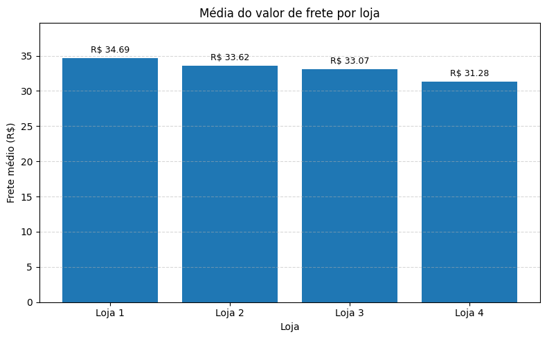

> 

A **Loja 4** tem o menor frete médio, o que pode ser um diferencial competitivo se os demais indicadores forem igualmente fortes ao fim da analise.

---

### Conclusão

Após análise de todos os indicadores, a **recomendação é que o Senhor João venda a Loja 4**.

**Justificativas:**

* É a loja com **menor faturamento** entre as quatro.
* Tem a **segunda pior média de avaliação** dos clientes.
* Embora tenha o **frete mais baixo**, isso não compensa a performance geral ser inferior as demais lojas.
* Não possui produtos ou categorias de grande destaque em comparação com as demais lojas.

As **Lojas 1, 2 e 3** apresentam melhores resultados gerais:

* **Loja 1** é a líder em faturamento;
* **Loja 3** é a mais bem avaliada pelos clientes;
* **Loja 2** tem equilíbrio entre desempenho e frete.

Portanto, a venda da Loja 4 é a opção mais vantajosa para manter os ativos com maior potencial de crescimento e rentabilidade.
